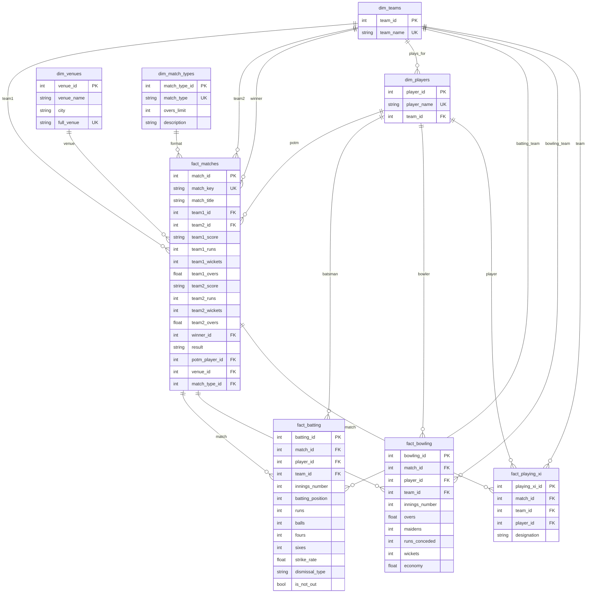

<p align="center">
  
  
  
</p>

<h1 align="center">CrickBuzz Scraper & Data Warehouse</h1>

<p align="center">
  <strong>A production-grade cricket data pipeline that scrapes international match data from Cricbuzz and loads it into a Star Schema data warehouse for analytics.</strong>
</p>

---

## Overview

This project implements a complete **ETL (Extract, Transform, Load)** pipeline for cricket data:

| Stage | Component | Description |
|-------|-----------|-------------|
| **Extract** | Web Scraper | Selenium-based scraper targeting Cricbuzz international matches |
| **Transform** | Data Parser | Cleans and normalizes player names, scores, and match data |
| **Load** | Data Warehouse | SQLite star schema optimized for analytical queries |

### Key Features

- **Modular Architecture** - Clean separation of concerns with dedicated modules
- **Duplicate Detection** - Smart deduplication using match URLs as unique keys
- **Team-Player Mapping** - Accurate player-team assignment using Playing XI data
- **Incremental Loading** - Supports re-running without duplicating data
- **Performance Indexed** - Optimized for analytical query patterns

---

## Architecture

```
┌─────────────────────────────────────────────────────────────────────────────┐
│                              DATA PIPELINE                                  │
├─────────────────────────────────────────────────────────────────────────────┤
│                                                                             │
│   ┌──────────────┐     ┌──────────────┐     ┌──────────────────────────┐    │
│   │              │     │              │     │                          │    │
│   │   CRICBUZZ   │────▶│   SCRAPER    │────▶│    international_data   │    │
│   │   WEBSITE    │     │   (Selenium) │     │         .json            │    │
│   │              │     │              │     │                          │    │
│   └──────────────┘     └──────────────┘     └────────────┬─────────────┘    │
│                                                          │                  │
│                                                          ▼                  │
│                                              ┌──────────────────────────┐   │
│                                              │                          │   │
│                                              │     ETL PIPELINE         │   │
│                                              │  (cricket_datawarehouse) │   │
│                                              │                          │   │
│                                              └────────────┬─────────────┘   │
│                                                          │                  │
│                                                          ▼                  │
│                                              ┌──────────────────────────┐   │
│                                              │                          │   │
│                                              │   STAR SCHEMA DATABASE   │   │
│                                              │   (cricket_warehouse.db) │   │
│                                              │                          │   │
│                                              └──────────────────────────┘   │
│                                                                             │
└─────────────────────────────────────────────────────────────────────────────┘
```

---

## Star Schema Design

The data warehouse implements a **Kimball-style star schema** optimized for cricket analytics.

### Entity Relationship Diagram



> **Tip**: On GitHub, click and drag to pan, scroll to zoom. Click the diagram for full-screen view.

---

## Schema Details

### Dimension Tables

<details>
<summary><b>dim_teams</b> - Team Master Data</summary>

| Column | Type | Constraints | Description |
|--------|------|-------------|-------------|
| `team_id` | INTEGER | PRIMARY KEY | Auto-incremented identifier |
| `team_name` | TEXT | UNIQUE, NOT NULL | Official team name (Title Case) |

**Sample Data:**
| team_id | team_name |
|---------|-----------|
| 1 | India |
| 2 | New Zealand |
| 3 | England |

</details>

<details>
<summary><b>dim_players</b> - Player Master Data</summary>

| Column | Type | Constraints | Description |
|--------|------|-------------|-------------|
| `player_id` | INTEGER | PRIMARY KEY | Auto-incremented identifier |
| `player_name` | TEXT | UNIQUE, NOT NULL | Player's full name |
| `team_id` | INTEGER | FOREIGN KEY | Reference to dim_teams |

**Note:** Player uniqueness is by name only. Team is updated when first encountered in Playing XI.

</details>

<details>
<summary><b>dim_venues</b> - Venue/Stadium Data</summary>

| Column | Type | Constraints | Description |
|--------|------|-------------|-------------|
| `venue_id` | INTEGER | PRIMARY KEY | Auto-incremented identifier |
| `venue_name` | TEXT | - | Stadium name |
| `city` | TEXT | - | City (parsed from full venue) |
| `full_venue` | TEXT | UNIQUE | Complete venue string |

</details>

<details>
<summary><b>dim_match_types</b> - Match Format Reference</summary>

| Column | Type | Constraints | Description |
|--------|------|-------------|-------------|
| `match_type_id` | INTEGER | PRIMARY KEY | Auto-incremented identifier |
| `match_type` | TEXT | UNIQUE, NOT NULL | T20I, ODI, Test, T20 |
| `overs_limit` | INTEGER | - | Maximum overs (NULL for Test) |
| `description` | TEXT | - | Full format name |

**Pre-seeded Values:**
| match_type | overs_limit | description |
|------------|-------------|-------------|
| T20I | 20 | Twenty20 International |
| ODI | 50 | One Day International |
| Test | NULL | Test Match |
| T20 | 20 | Twenty20 |

</details>

### Fact Tables

<details>
<summary><b>fact_matches</b> - Match Results (Central Fact Table)</summary>

| Column | Type | Description |
|--------|------|-------------|
| `match_id` | INTEGER | Primary key |
| `match_key` | TEXT | Unique identifier (match URL) |
| `match_title` | TEXT | Full match title |
| `team1_id` | INTEGER | FK to dim_teams |
| `team2_id` | INTEGER | FK to dim_teams |
| `team1_score` | TEXT | Raw score string (e.g., "153/9 (20 Ov)") |
| `team1_runs` | INTEGER | Parsed runs |
| `team1_wickets` | INTEGER | Parsed wickets |
| `team1_overs` | REAL | Parsed overs |
| `team2_score` | TEXT | Raw score string |
| `team2_runs` | INTEGER | Parsed runs |
| `team2_wickets` | INTEGER | Parsed wickets |
| `team2_overs` | REAL | Parsed overs |
| `winner_id` | INTEGER | FK to dim_teams |
| `result` | TEXT | Match result description |
| `potm_player_id` | INTEGER | FK to dim_players (Player of the Match) |
| `venue_id` | INTEGER | FK to dim_venues |
| `match_type_id` | INTEGER | FK to dim_match_types |

</details>

<details>
<summary><b>fact_batting</b> - Individual Batting Performances</summary>

| Column | Type | Description |
|--------|------|-------------|
| `batting_id` | INTEGER | Primary key |
| `match_id` | INTEGER | FK to fact_matches |
| `player_id` | INTEGER | FK to dim_players |
| `team_id` | INTEGER | FK to dim_teams |
| `innings_number` | INTEGER | 1st or 2nd innings |
| `batting_position` | INTEGER | Order in batting lineup |
| `runs` | INTEGER | Runs scored |
| `balls` | INTEGER | Balls faced |
| `fours` | INTEGER | Boundaries (4s) |
| `sixes` | INTEGER | Sixes hit |
| `strike_rate` | REAL | Batting strike rate |
| `dismissal_type` | TEXT | How out (or "not out") |
| `is_not_out` | BOOLEAN | Not out flag |

</details>

<details>
<summary><b>fact_bowling</b> - Individual Bowling Performances</summary>

| Column | Type | Description |
|--------|------|-------------|
| `bowling_id` | INTEGER | Primary key |
| `match_id` | INTEGER | FK to fact_matches |
| `player_id` | INTEGER | FK to dim_players |
| `team_id` | INTEGER | FK to dim_teams |
| `innings_number` | INTEGER | Which innings bowled |
| `overs` | REAL | Overs bowled |
| `maidens` | INTEGER | Maiden overs |
| `runs_conceded` | INTEGER | Runs given |
| `wickets` | INTEGER | Wickets taken |
| `economy` | REAL | Economy rate |

</details>

<details>
<summary><b>fact_playing_xi</b> - Team Composition Per Match</summary>

| Column | Type | Description |
|--------|------|-------------|
| `playing_xi_id` | INTEGER | Primary key |
| `match_id` | INTEGER | FK to fact_matches |
| `team_id` | INTEGER | FK to dim_teams |
| `player_id` | INTEGER | FK to dim_players |
| `designation` | TEXT | Role (Captain, WK, etc.) |

**Constraints:** UNIQUE(match_id, team_id, player_id)

</details>

### Performance Indexes

```sql
idx_batting_match      ON fact_batting(match_id)
idx_batting_player     ON fact_batting(player_id)
idx_bowling_match      ON fact_bowling(match_id)
idx_bowling_player     ON fact_bowling(player_id)
idx_matches_winner     ON fact_matches(winner_id)
idx_playing_xi_match   ON fact_playing_xi(match_id)
```

---

## Quick Start

### Prerequisites

- Python 3.10+
- Google Chrome Browser
- ChromeDriver (auto-managed by webdriver-manager)

### Installation

```bash
# Clone repository
git clone https://github.com/yourusername/crickbuzz-scraper.git
cd crickbuzz-scraper

# Create virtual environment
python -m venv venv

# Activate (Windows)
venv\Scripts\activate

# Activate (Linux/Mac)
source venv/bin/activate

# Install dependencies
pip install -r requirements.txt
```

### Usage

```bash
# Step 1: Scrape matches from Cricbuzz
python main.py

# Step 2: Load data into warehouse
python cricket_datawarehouse.py
```

### Output

```
==================================================
CRICKET DATA WAREHOUSE - ETL
==================================================

Creating schema...
Schema created successfully
Loading 11 matches...
Loaded: 11, Skipped: 0

==================================================
DATA WAREHOUSE SUMMARY
==================================================
  Teams                    : 9
  Players                  : 118
  Venues                   : 7
  Matches                  : 11
  Batting Records          : 183
  Bowling Records          : 137
  Playing XI Records       : 242
==================================================
```

---

## Data Flow

```
                                    SCRAPER FLOW
┌─────────────────────────────────────────────────────────────────────────────┐
│                                                                             │
│  Cricbuzz Recent Matches                                                    │
│          │                                                                  │
│          ▼                                                                  │
│  ┌───────────────┐                                                          │
│  │   collector   │──▶ Filter International Matches                         │
│  └───────────────┘                                                          │
│          │                                                                  │
│          ▼                                                                  │
│  ┌───────────────┐     ┌─────────────────┐     ┌──────────────────┐         │
│  │    scraper    │────▶│   match_info    │────▶│  Title, Teams,  │         │
│  │               │     │   extractor     │     │  Scores, Result  │         │
│  │               │     └─────────────────┘     └──────────────────┘         │
│  │               │                                                          │
│  │               │     ┌─────────────────┐     ┌──────────────────┐         │
│  │               │────▶│   playing_xi    │────▶│  22 Players +    │        │
│  │               │     │   extractor     │     │  Designations    │         │
│  │               │     └─────────────────┘     └──────────────────┘         │
│  │               │                                                          │
│  │               │     ┌─────────────────┐     ┌──────────────────┐         │
│  │               │────▶│   scorecard     │────▶│  Batting &       │        │
│  └───────────────┘     │   extractor     │     │  Bowling Stats   │         │
│                        └─────────────────┘     └──────────────────┘         │
│          │                                                                  │
│          ▼                                                                  │
│  ┌───────────────────────────────────────────────────────────────────────┐  │
│  │                     international_data.json                           │  │
│  └───────────────────────────────────────────────────────────────────────┘  │
│                                                                             │
└─────────────────────────────────────────────────────────────────────────────┘

                                    ETL FLOW
┌─────────────────────────────────────────────────────────────────────────────┐
│                                                                             │
│  JSON Data                                                                  │
│      │                                                                      │
│      ▼                                                                      │
│  ┌──────────────────────────────────────────────────────────────────────┐   │
│  │                         TRANSFORM                                    │   │
│  │  ┌─────────────┐  ┌─────────────┐  ┌─────────────┐  ┌─────────────┐  │   │
│  │  │ Parse Scores│  │ Clean Names │  │ Map Players │  │ Deduplicate │  │   │
│  │  │ 153/9 (20)  │  │ Remove (c)  │  │ to Teams    │  │ by URL Key  │  │   │
│  │  └─────────────┘  └─────────────┘  └─────────────┘  └─────────────┘  │   │
│  └──────────────────────────────────────────────────────────────────────┘   │
│      │                                                                      │
│      ▼                                                                      │
│  ┌──────────────────────────────────────────────────────────────────────┐   │
│  │                           LOAD                                       │   │
│  │                                                                      │   │
│  │   dim_teams ◄──┐                                                     │   │
│  │                │                                                     │   │
│  │   dim_players ◄┼──── fact_matches ────► fact_batting                 │   │
│  │                │           │                                         │   │
│  │   dim_venues ◄─┘           └──────────► fact_bowling                 │   │
│  │                                    │                                 │   │
│  │   dim_match_types ◄────────────────┴──► fact_playing_xi              │   │
│  │                                                                      │   │
│  └──────────────────────────────────────────────────────────────────────┘   │
│      │                                                                      │
│      ▼                                                                      │
│  ┌───────────────────────────────────────────────────────────────────────┐  │
│  │                      cricket_warehouse.db                             │  │
│  └───────────────────────────────────────────────────────────────────────┘  │
│                                                                             │
└─────────────────────────────────────────────────────────────────────────────┘
```

---

## Project Structure

```
CrickBuzz Scraper/
│
├── main.py                    # Entry point - orchestrates scraping
├── config.py                  # Configuration constants
├── driver.py                  # Selenium WebDriver management
├── collector.py               # Match URL collector
├── scraper.py                 # Match data scraper
├── utils.py                   # Utility functions
│
├── extractors/                # Data extraction modules
│   ├── __init__.py
│   ├── match_info.py          # Match metadata extractor
│   ├── playing_xi.py          # Playing XI extractor
│   └── scorecard.py           # Scorecard extractor
│
├── cricket_datawarehouse.py   # ETL & Star Schema
├── cricket_warehouse.db       # SQLite Database
│
├── requirements.txt           # Python dependencies
├── .gitignore                 # Git ignore rules
└── README.md                  # Documentation
```

---

## Tech Stack

| Component | Technology |
|-----------|------------|
| Language | Python 3.10+ |
| Web Scraping | Selenium WebDriver |
| HTML Parsing | BeautifulSoup4 |
| Database | SQLite3 |
| Data Format | JSON |


---

<p align="center">
  <sub>Built for cricket analytics</sub>
</p>
